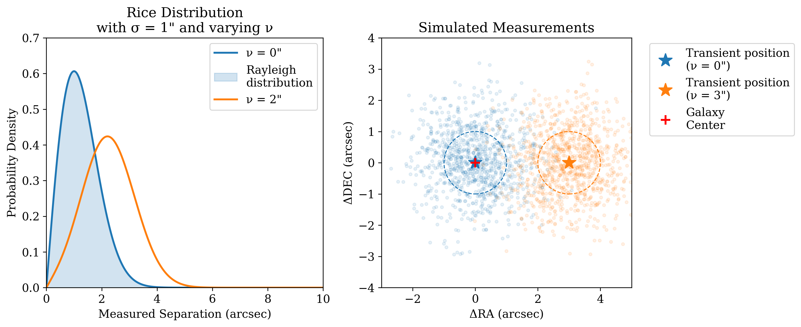

.. _methodology:

Methodology
===========

The core statistical analysis in ``iinuclear`` is handled by two main functions: ``rice_separation`` 
and ``check_nuclear``. These implement different statistical approaches to determine whether a 
transient is coincident with a galaxy center.

Rice Distribution Analysis
--------------------------

When measuring the separation between a transient and its host galaxy center, we are effectively 
measuring the magnitude of a 2D vector (the offset) that has Gaussian uncertainty in each component
(the location of the transient and the location of the galaxy). In this situation, even if the true
separation is zero, measurement errors will always produce positive measured separations.

The Rice Distribution
~~~~~~~~~~~~~~~~~~~~~

The Rice distribution is a probability distribution that describes the magnitude of a vector :math:`R` when
its components have independent Gaussian noise. This distribution models the probability distribution of
the measured separation given the true separation and the measurement uncertainty.

.. math::

   f(r|\nu,\sigma) = \frac{r}{\sigma^2} \exp\left(-\frac{r^2 + \nu^2}{2\sigma^2}\right) I_0\left(\frac{r\nu}{\sigma^2}\right)

where:

* :math:`r` is the measured separation
* :math:`\nu` is the true separation
* :math:`\sigma` is the measurement uncertainty
* :math:`I_0` is the modified Bessel function of the first kind with order zero

.. _rice_distribution:

   **The Rice Distribution and Position Measurements.** *Left:* The probability density function 
   of the Rice distribution for different true separations (ν) and fixed measurement uncertainty 
   (σ = 1"). When the true separation is zero (blue), the distribution reduces to a Rayleigh 
   distribution, showing why measured separations are always positive even when a source is 
   truly nuclear. As the true separation increases (orange), the distribution becomes 
   more Gaussian-like. *Right:* Simulated position measurements (small points) for a nuclear 
   source (blue) and an offset source (orange). The true positions are marked with stars, 
   and dashed circles show the 1σ measurement uncertainty. The red cross marks the galaxy 
   center. Even for the nuclear source (ν = 0"), measurement uncertainties create a cloud of 
   detections with non-zero separations, following the Rayleigh distribution shown in blue in 
   the left panel.

Maximum Likelihood Estimation
~~~~~~~~~~~~~~~~~~~~~~~~~~~~~

The ``rice_separation`` function finds the most likely true separation by maximizing the likelihood:

.. math::

   \mathcal{L}(\nu,\sigma|r_1,...,r_n) = \prod_{i=1}^n f(r_i|\nu,\sigma)

or equivalently, minimizing the negative log-likelihood:

.. math::

   -\ln\mathcal{L} = -\sum_{i=1}^n \ln f(r_i|\nu,\sigma)

The function returns:

* The maximum likelihood estimate of the true separation
* Asymmetric confidence intervals (since the distribution is non-Gaussian)
* The signal-to-noise ratio (SNR = :math:`\nu/\sigma`)
* An upper limit when the separation is not significant

For high SNR (Default of 3), the function switches to standard Gaussian statistics as the Rice distribution 
approaches a normal distribution in this regime.

This demonstrates why special statistical treatment is needed when determining whether a transient 
is truly coincident with a galaxy center. Standard Gaussian statistics would be inappropriate 
for analyzing the distribution of measured separations, particularly for nuclear or nearly-nuclear 
sources.

Nuclear Classification
----------------------

The ``check_nuclear`` function determines whether a transient's position is statistically consistent 
with the galaxy center using a multivariate analysis.

Covariance Analysis
~~~~~~~~~~~~~~~~~~~

The function accounts for two sources of uncertainty:

1. ZTF Position Measurements:
   
   .. math::

      \Sigma_{\mathrm{ZTF}} = \begin{pmatrix} 
      \sigma_{\mathrm{RA}}^2 & \sigma_{\mathrm{RA,Dec}} \\
      \sigma_{\mathrm{RA,Dec}} & \sigma_{\mathrm{Dec}}^2
      \end{pmatrix}

2. Galaxy Center Uncertainty:

   .. math::

      \Sigma_{\mathrm{gal}} = \begin{pmatrix}
      \sigma_{\mathrm{gal}}^2 & 0 \\
      0 & \sigma_{\mathrm{gal}}^2
      \end{pmatrix}

The total covariance matrix is their sum:

.. math::

   \Sigma_{\mathrm{total}} = \Sigma_{\mathrm{ZTF}}/N + \Sigma_{\mathrm{gal}}

where N is the number of ZTF detections.

Statistical Test
~~~~~~~~~~~~~~~~

The test statistic is the Mahalanobis distance, which generalizes the concept of how many "number of sigmas" 
the transient is away from the galaxy center, but in multiple dimensions:

.. math::

   \chi^2 = \mathbf{d}^T \Sigma_{\mathrm{total}}^{-1} \mathbf{d}

where :math:`\mathbf{d}` is the vector from the galaxy center to the mean ZTF position.

Under the null hypothesis (that the transient is nuclear), this statistic follows a :math:`\chi^2` 
distribution with 2 degrees of freedom. The p-value is:

.. math::

   p = 1 - F_{\chi^2}(\chi^2, k=2)

where :math:`F_{\chi^2}` is the cumulative distribution function of the :math:`\chi^2` distribution.

A transient is classified as nuclear if :math:`p > 0.05`, indicating that we cannot reject the null 
hypothesis at the 95% confidence level.

Interpretation
~~~~~~~~~~~~~~

* A high p-value (>0.05) suggests the position is consistent with being nuclear.
* A low p-value (<0.05) suggests the position is significantly offset from the nucleus.
* The square root of :math:`\chi^2` indicates how many "sigmas" away from nuclear the transient is.
