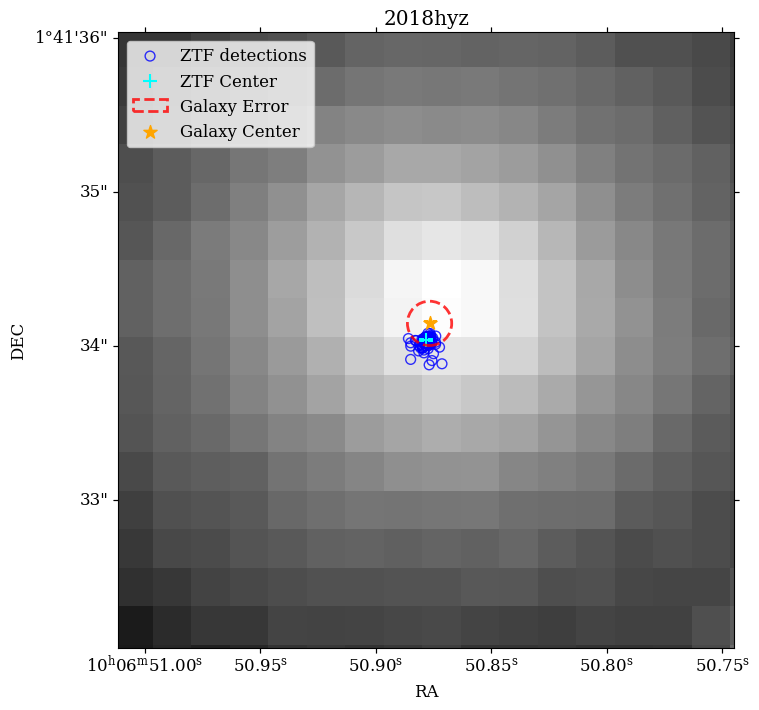
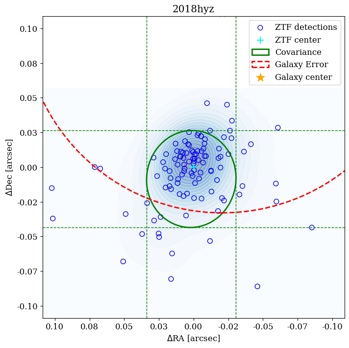
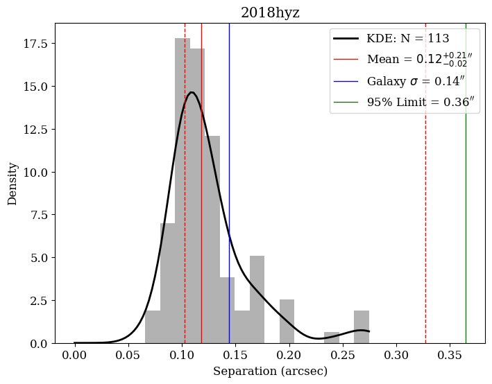
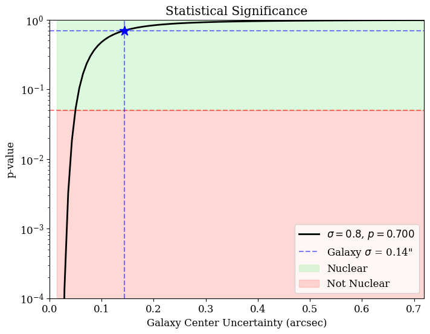

.. _usage:

Usage
=====

Basic Usage
-----------

The simplest way to use ``iinuclear`` is through the main ``isit`` function:

.. code-block:: python

    from iinuclear import isit

    # Using an IAU name
    isit("2018hyz")

    # Using a ZTF name
    isit("ZTF18acpdvos")

    # Using coordinates (in degrees)
    isit(151.711964138, 1.69279894089)

This function will produce a plot with all diagnostics to determine if the transient is nuclear.

Requirements
------------

For ``iinuclear`` to work properly:

* The transient must have detections in ZTF in Alerce.
* The host galaxy must be visible in PanSTARRS.
* If the input is an IAU name, the object must be in the TNS.

Core Functions
--------------

get_data
~~~~~~~~
The ``get_data`` function retrieves all necessary information about a transient and its host, including:

* Retrieves ZTF light curves from the ALeRCE database.
* Obtains coordinates from TNS if only an IAU name is provided.
* Gets galaxy information from PanSTARRS and SDSS catalogs including:
    - Coordinates
    - Magnitudes
    - Galaxy size
    - Positional uncertainties
* Downloads a PanSTARRS image with WCS information

.. code-block:: python

    from iinuclear.utils import get_data
    
    ras, decs, ztf_name, iau_name, catalog_result, image_data, image_header = get_data("2018hyz")

get_galaxy_center
~~~~~~~~~~~~~~~~~
This function determines the center of the host galaxy:

* Combines position measurements from different filters and surveys.
* Includes a minimum uncertainty (default of 0.1 arcsec) to account for astrometric solution limitations.
* Alternatively, if no error is given, this will be calculated from the positional uncertainties between ZTF and PanSTARRS.
* Returns central coordinates and total positional uncertainty.

.. code-block:: python

    from iinuclear.utils import get_galaxy_center
    
    ra_galaxy, dec_galaxy, error_arcsec = get_galaxy_center(catalog_result)

calc_separations
~~~~~~~~~~~~~~~~
Calculates angular separations between transient positions and galaxy center:

.. code-block:: python

    from iinuclear.utils import calc_separations
    
    separations = calc_separations(ras, decs, ra_galaxy, dec_galaxy)

check_nuclear
~~~~~~~~~~~~~
Determines whether a transient is nuclear based on the data from all previous functions:

.. code-block:: python

    from iinuclear.utils import check_nuclear
    
    chi2_val, p_val, is_nuclear = check_nuclear(ras, decs, ra_galaxy, dec_galaxy, error_arcsec)

* Calculates :math:`\chi^2` statistic for position matching
* Returns p-value for nuclear hypothesis (p < 0.05 is not nuclear)
* Boolean flag for nuclear classification (True if p > 0.05)

Plotting Functions
------------------

plot_image
~~~~~~~~~~
Creates a PanSTARRS image cutout with ZTF positions overlaid:

.. code-block:: python

    from iinuclear.plots import plot_image
    
    plot_image(image_data, image_header, ras, decs, ra_galaxy=ra_galaxy, 
              dec_galaxy=dec_galaxy, error_arcsec=error_arcsec, ax=ax)
    plt.show()

   PanSTARRS image cutout showing the host galaxy with ZTF positions overlaid as blue points. The galaxy center is
   marked with an orange star, and the uncertainty radius is shown as a red circle.

plot_detections
~~~~~~~~~~~~~~~
Scatter plot of ZTF detections with density contours:

.. code-block:: python

    from iinuclear.plots import plot_detections
    
    plot_detections(ras, decs, ra_galaxy=ra_galaxy, dec_galaxy=dec_galaxy, 
                   error_arcsec=error_arcsec, ax=ax)
    plt.show()

   Spatial distribution of ZTF detections shown as blue points relative to the galaxy center marked as an orange star. 
   Contours show the density of detections, and the red circle indicates the galaxy center uncertainty.

plot_histogram
~~~~~~~~~~~~~~
Histogram of separations between ZTF positions and galaxy center:

.. code-block:: python

    from iinuclear.plots import plot_histogram
    
    plot_histogram(separations, error_arcsec, ax=ax)
    plt.show()

   Histogram of angular separations between ZTF positions and the galaxy center. 
   The red line shows the mean separation, with dashed lines indicating the uncertainty range. 
   The kernel density estimate is shown in black. The 95\% upper limit is marked as a green line.

plot_pvalue_curve
~~~~~~~~~~~~~~~~~
Shows how p-value changes with galaxy center uncertainty:

.. code-block:: python

    from iinuclear.plots import plot_pvalue_curve
    
    plot_pvalue_curve(ras, decs, ra_galaxy, dec_galaxy, error_arcsec, ax=ax)
    plt.show()

   P-value as a function of galaxy center uncertainty. The blue star shows the measured uncertainty 
   and corresponding p-value. The green shaded region indicates p > 0.05 (nuclear), while the red 
   region indicates p < 0.05 (non-nuclear).
